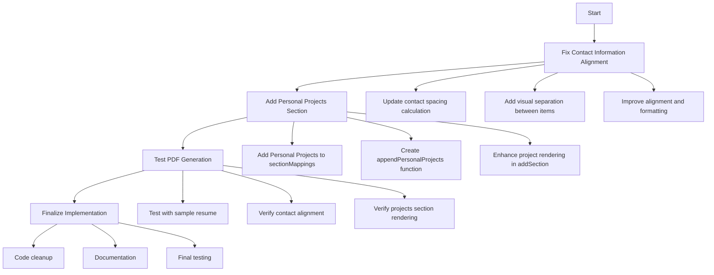

# PDF Resume Enhancement Plan

## Overview

This document outlines the plan to address two issues with the PDF resume generation:

1. **Contact Information Alignment**: The contact information items (email, phone, LinkedIn) in the header are not evenly spaced or aligned properly.
2. **Personal Projects Section**: Add a personal projects section to every downloaded resume.

## Current System Analysis

The application uses `generateUnifiedPDF` from `unifiedPDFGenerator.ts` for PDF generation, which is called from the `EnhancedDownloadHub.tsx` component. The PDF generation includes header formatting, section rendering, and content styling.

## Issue 1: Contact Information Alignment

### Current Implementation

The current implementation in `unifiedPDFGenerator.ts` (lines 338-431) has issues with the spacing and alignment of contact information items:

```typescript
if (contactInfo.length > 0) {
  let contactY = y;
  let contactX = margin;
  const contactSpacing = (maxWidth) / Math.min(contactInfo.length, 3);

  contactInfo.slice(0, 3).forEach((contact) => {
    const cleanContact = cleanText(contact);
    let icon = '';
    if (cleanContact.includes('@')) {
      icon = contactIcons.gmail;
    } else if (cleanContact.includes('+') || cleanContact.includes('phone')) {
      icon = contactIcons.phone;
    } else if (cleanContact.includes('linkedin')) {
      icon = contactIcons.linkedin;
    }
    addText(`${icon} ${cleanContact}`, contactX, contactY, {
      fontSize: 8,
      color: colors.light,
      fontStyle: 'normal',
      highlight: false
    });
    contactX += contactSpacing;
  });
}
```

### Proposed Changes

1. Improve the contact spacing calculation to ensure even distribution
2. Add visual separation between contact items
3. Improve the alignment and formatting of contact information

```typescript
if (contactInfo.length > 0) {
  let contactY = y;
  
  // Calculate proper spacing based on page width and number of items
  const totalItems = Math.min(contactInfo.length, 3);
  const availableWidth = maxWidth - 10; // Subtract some padding
  const itemWidth = availableWidth / totalItems;
  
  // Create a more visually appealing contact row
  addBackground(margin - 5, contactY - 4, pageWidth - (margin * 2) + 10, 10, colors.highlight);
  
  contactInfo.slice(0, totalItems).forEach((contact, index) => {
    const cleanContact = cleanText(contact);
    let icon = '';
    
    // Enhanced icon selection
    if (cleanContact.includes('@')) {
      icon = contactIcons.gmail;
    } else if (cleanContact.includes('+') || cleanContact.includes('phone')) {
      icon = contactIcons.phone;
    } else if (cleanContact.includes('linkedin')) {
      icon = contactIcons.linkedin;
    } else if (cleanContact.includes('github')) {
      icon = '🔗'; // GitHub icon
    } else if (cleanContact.includes('location') || cleanContact.includes('address')) {
      icon = '📍'; // Location icon
    }
    
    // Calculate position for even distribution
    const contactX = margin + (index * itemWidth);
    
    // Add contact text with icon and better styling
    addText(`${icon} ${cleanContact}`, contactX, contactY, {
      fontSize: 9, // Slightly larger for better readability
      color: colors.secondary, // Darker color for better contrast
      fontStyle: 'normal',
      highlight: false,
      align: 'left' // Ensure left alignment
    });
  });
  
  // Handle additional contacts on next line if needed
  if (contactInfo.length > 3) {
    contactY += 5; // Proper spacing between rows
    
    // Add background for second row
    addBackground(margin - 5, contactY - 4, pageWidth - (margin * 2) + 10, 10, colors.highlight);
    
    const remainingItems = Math.min(contactInfo.length - 3, 3);
    const remainingItemWidth = availableWidth / remainingItems;
    
    contactInfo.slice(3, 6).forEach((contact, index) => {
      const cleanContact = cleanText(contact);
      let icon = '';
      
      // Same icon selection logic as above
      if (cleanContact.includes('@')) {
        icon = contactIcons.gmail;
      } else if (cleanContact.includes('+') || cleanContact.includes('phone')) {
        icon = contactIcons.phone;
      } else if (cleanContact.includes('linkedin')) {
        icon = contactIcons.linkedin;
      } else if (cleanContact.includes('github')) {
        icon = '🔗';
      } else if (cleanContact.includes('location') || cleanContact.includes('address')) {
        icon = '📍';
      }
      
      const contactX = margin + (index * remainingItemWidth);
      
      addText(`${icon} ${cleanContact}`, contactX, contactY, {
        fontSize: 9,
        color: colors.secondary,
        fontStyle: 'normal',
        highlight: false,
        align: 'left'
      });
    });
  }
  
  // Update the y position for subsequent content
  y = contactY + 6;
}
```

## Issue 2: Adding Personal Projects Section

### Implementation Steps

1. Add "Personal Projects" to the section mappings array in `unifiedPDFGenerator.ts`
2. Create a parser for the HTML content provided by the user
3. Implement project card styling for the PDF output

### Step 1: Add Personal Projects to Section Mappings

Modify the section mappings array (around line 539) to include the personal projects section:

```typescript
const sectionMappings = type === 'cover-letter' ? [
  // Cover letter sections
] : type === 'email' ? [
  // Email sections
] : [
  { keys: ['professionalsummary', 'summary', 'profile'], title: 'Professional Summary' },
  { keys: ['keyskills', 'skills', 'technicalskills'], title: 'Key Skills' },
  { keys: ['workexperience', 'experience', 'employment', 'career'], title: 'Work Experience' },
  { keys: ['education', 'educationcertifications', 'qualifications'], title: 'Education' },
  { keys: ['certifications', 'certificates'], title: 'Certifications' },
  { keys: ['personalprojects', 'projects', 'sideprojects'], title: 'Personal Projects' }, // Add this line
  { keys: ['additionalinformation', 'additional', 'other'], title: 'Additional Information' }
];
```

### Step 2: Add Personal Projects HTML Content

We need to ensure that the personal projects HTML content is included in the resume content. Since we want to include it in every resume, we'll add a function to append the personal projects section to the resume content if it doesn't already exist:

```typescript
// Add this function to unifiedPDFGenerator.ts
const appendPersonalProjects = (resumeText: string): string => {
  // Check if the resume already has a personal projects section
  if (resumeText.includes('PERSONAL PROJECTS') || resumeText.includes('PROJECTS')) {
    return resumeText; // Already has projects section
  }
  
  // Personal projects HTML content provided by the user
  const personalProjectsContent = `
PERSONAL PROJECTS

• Agentia Creator | AI • TypeScript • Java
  Innovative AI-powered content creation platform with Java Spring Boot backend and TypeScript frontend. Features intelligent content generation, user management, and scalable microservices architecture.
  Tech: Java 11, Spring Boot, TypeScript, PostgreSQL, Redis, Docker
  GitHub: https://github.com/bhupenderkumar/agentia-creator

• AI System Design Backend | AI • Backend • TypeScript
  Comprehensive backend system for AI-driven system design tools. Built with modern TypeScript and Java integration, featuring real-time processing, algorithm optimization, and scalable architecture.
  Tech: TypeScript, Java, Spring Boot, Machine Learning APIs, AWS
  GitHub: https://github.com/bhupenderkumar/aisystemdesignbackend

• Building Helper | Construction • Java • Web
  Complete construction management platform helping customers streamline their building projects. Java-based backend with comprehensive project management, cost estimation, and contractor coordination features.
  Tech: Java 8, Spring Boot, MySQL, Angular, REST APIs, Maven
  GitHub: https://github.com/bhupenderkumar/buildinghelper

• CryptoPatch | Crypto • JavaScript • Security
  Advanced cryptocurrency security and patching tool built with JavaScript and Java backend integration. Features vulnerability scanning, security patches, and blockchain transaction monitoring.
  Tech: JavaScript, Java, Spring Security, Blockchain APIs, MongoDB
  GitHub: https://github.com/bhupenderkumar/CryptoPatch

• CryptoPrice Tracker | Fintech • Java • APIs
  Real-time cryptocurrency price tracking application with Java backend. Features live price feeds, portfolio management, alerts system, and comprehensive market analysis tools.
  Tech: Java 11, Spring Boot, External APIs, WebSocket, PostgreSQL
  GitHub: https://github.com/bhupenderkumar/CryptoPrice

• Edu Connect Gateway | Education • TypeScript • Gateway
  Educational platform API gateway built with TypeScript and Java microservices. Provides secure authentication, course management, student tracking, and integrated learning management system.
  Tech: TypeScript, Java, Spring Cloud Gateway, OAuth2, Microservices
  GitHub: https://github.com/bhupenderkumar/edu-connect-gateway
`;

  return resumeText + '\n\n' + personalProjectsContent;
};
```

### Step 3: Modify the generateUnifiedPDF Function

Update the main function to use our new appendPersonalProjects function:

```typescript
export const generateUnifiedPDF = ({ resume, language, country, type = 'resume' }: UnifiedPDFOptions) => {
  // Ensure personal projects are included in the resume
  const enhancedResume = appendPersonalProjects(resume);
  
  // Rest of the function remains the same, but uses enhancedResume instead of resume
  const pdf = new jsPDF();
  // ...
  
  const { sections, headerInfo } = parseResume(enhancedResume);
  
  // ...rest of the function...
}
```

### Step 4: Enhance Project Rendering in addSection Function

Add special handling for project cards in the addSection function:

```typescript
// Inside the addSection function, add special handling for project cards
if (title.toUpperCase() === 'PERSONAL PROJECTS') {
  // Project cards need special formatting
  content.forEach(item => {
    const cleanItem = cleanText(item);
    if (!cleanItem) return;
    
    // Check if we need a new page before adding content
    if (yPos > pageHeight - 40) {
      pdf.addPage();
      yPos = margin;
    }
    
    // Project title and type (format: "Project Name | Type • Tech • Tech")
    if (cleanItem.includes('|')) {
      const parts = cleanItem.split('|').map(p => p.trim());
      const projectName = parts[0];
      const projectType = parts[1] || '';
      
      // Add project name with highlight background
      addBackground(margin - 2, yPos - 6, maxWidth + 4, 10, colors.highlight);
      
      // Project name (bold, primary color)
      yPos = addText(projectName, margin, yPos, {
        fontSize: 11,
        fontStyle: 'bold',
        color: colors.primary,
        highlight: false
      });
      
      // Project type/technologies (if available)
      if (projectType) {
        addText(projectType, margin + 15, yPos - 4, {
          fontSize: 9,
          fontStyle: 'italic',
          color: colors.accent,
          highlight: true
        });
      }
      
      yPos += 4;
    }
    // Project description or tech stack
    else if (cleanItem.startsWith('Tech:')) {
      // Technology stack with special formatting
      addBackground(margin, yPos - 3, maxWidth, 6, colors.background);
      
      yPos = addText(cleanItem, margin + 4, yPos, {
        fontSize: 9,
        fontStyle: 'bold',
        color: colors.tech,
        highlight: true
      });
      
      yPos += 3;
    }
    // GitHub link
    else if (cleanItem.startsWith('GitHub:')) {
      yPos = addText(cleanItem, margin + 4, yPos, {
        fontSize: 9,
        fontStyle: 'normal',
        color: colors.primary,
        highlight: false
      });
      
      yPos += 6; // Add extra space after each project
    }
    // Regular project description
    else {
      yPos = addText(cleanItem, margin + 4, yPos, {
        fontSize: 10,
        fontStyle: 'normal',
        color: colors.secondary,
        highlight: true,
        lineHeight: 1.3
      });
      
      yPos += 2;
    }
  });
  
  return yPos + 8; // Add extra space after projects section
}
```

## Implementation Flow Diagram



## Testing Plan

1. Test the PDF generation with a sample resume
2. Verify that contact information is properly aligned and evenly spaced
3. Verify that the personal projects section is included and properly formatted
4. Test with different resume content to ensure robustness

## Summary of Changes

1. **Contact Information Alignment**:
   - Improved spacing calculation for even distribution
   - Added visual separation between contact items
   - Enhanced icon selection and formatting
   - Better handling of multiple rows of contact information

2. **Personal Projects Section**:
   - Added "Personal Projects" to section mappings
   - Created function to append personal projects content if not present
   - Enhanced project card rendering with special formatting for:
     - Project titles and types
     - Project descriptions
     - Technology stacks
     - GitHub links

These changes will ensure that the contact information in the header is properly aligned and that the personal projects section is included in every downloaded resume with attractive formatting.